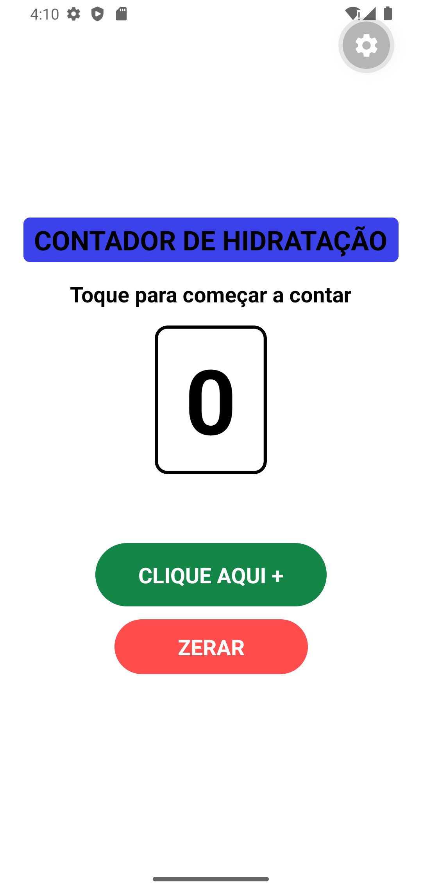
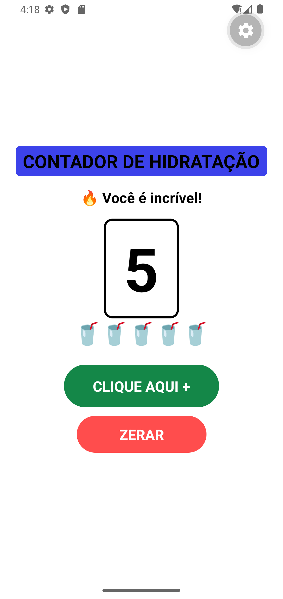
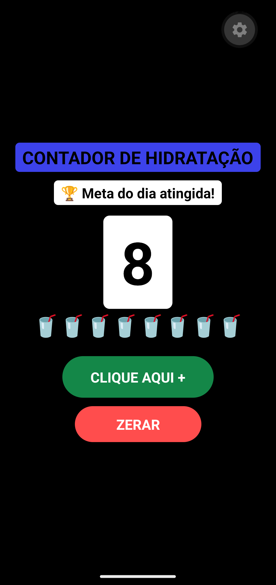
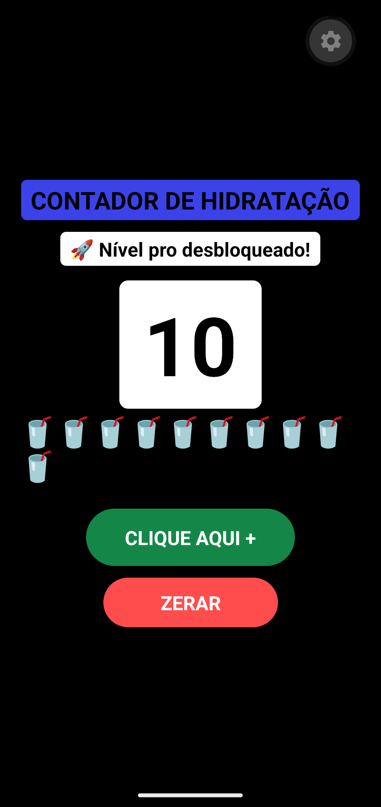
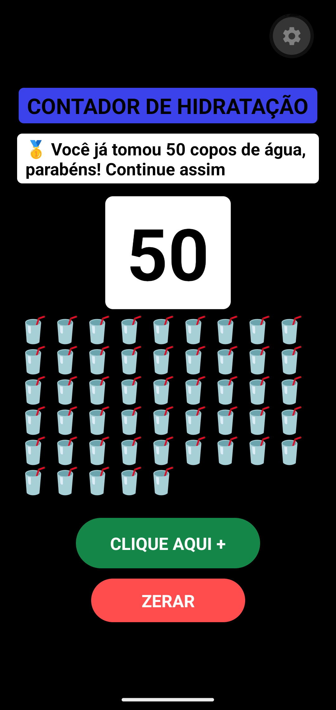

# 💧 Contador de Hidratação

Aplicativo simples desenvolvido em React Native para auxiliar no acompanhamento diário do consumo de água.

## Funcionalidades

- Contador de copos de água consumidos
- Mensagens de incentivo conforme o progresso
- Meta diária de hidratação
- Desbloqueio de níveis conforme a evolução
- Tema claro e escuro
- Botão para zerar o contador

## Tecnologias utilizadas

- React Native
- Expo
- JavaScript

## 📱 Capturas de Tela

### Tela Inicial

### Incentivo aos 5 copos

### Meta diária atingida

### Nível desbloqueado

### Marco de 50 copos

### Contador zerado

## Objetivo

O projeto foi desenvolvido com o objetivo de incentivar hábitos saudáveis por meio do acompanhamento simples e visual da hidratação diária.
